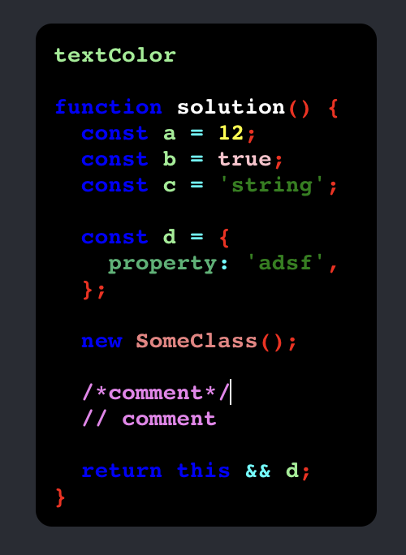

# 🧑‍💻 React Web Code-editor

**A Simple and code-style Customizable web code editor with ⚛ React**

<div style="display: flex; justify-content: space-between;">
  
  
</div>

### you can Try this on now! in [CodeSandBox!](https://codesandbox.io/s/fervent-albattani-r7yiz7)

**support React version >= 17**

# ⚙️ Features

**🎉 Type the code just like VSCode**

- 🎨 Automatic Syntax highlighting
- 🌃 Dark-mode & You can create your own Theme and syntax hightlight colors!
- 🗜 Indent line automatically, and also customizable!
- 🔒 Automatic parenthesis closing
- 🗞 Wrap selected text in parens

# 🏃 Let's get it Started!

### install

```
$ npm i react-web-code-editor
```

### implement & use

```tsx
import React from 'react';
import CodeEditor from 'react-web-code-editor';

function App() {
  return (
    <div className="App">
      <header className="App-header">
        <CodeEditor
          theme="light"
          language="javascript"
          indent={2}
          width='210px'
          height='210px'
          fontSize='14px'
          fontWeight='bold'
          className=''
          ref={null}
          interpolation={null}
        />
      </header>
    </div>
  );
}

export default App;
```

# 🙏 Contribute!

If there are some problems you want to solve in this project,

If you have some ideas of new feature you want to add in this project,

feel free to issue, PR or mail anytime you want.

It would be grateful! 🎉

## Development

Run this project in dev mode.

```
$ npm start
```

## 🎢 Plans to Development! v2

I think this Light Editor is just like sticky note. 📑

so, i have plan to develop this code-editor to control easily and to share the code easily.

- Float mode 🛫

  Set this editor can **float around page display.**
  also, user can **drag & drop** this editor anywhere in display.

- Screeshot 🏞

  User can capture this code editor! also can download captured editor screenshot.

  Share the codes more easily by using screenshot.

## 🏋️ Version up log

version | details
--- | ---
v.1.0.5 | Fix '\|' key input bug

# 🗂 Document

- **Component props**
- **How to create custom theme**

## CodeEditor Component props

```typescript
interface CodeEditorProps {
  indent?: number
  theme?: themeList
  language?: lang
  width?: string
  height?: string
  fontSize?: string
  fontWeight?: FontWeight
  className?: string
  interpolation?: FlattenSimpleInterpolation
}
```

### indent

set indent count.

it affects when auto indented (like bracket and enter to new line) or 'tab' to indent some line.

### theme

set the code editor theme.

you can use **'light'**, **'dark'** theme in default.

also! you can add your own theme! check below to how to add it!

### language

set the programming language.

syntax hightlight will follow the language you setted.

### width, height

set the code editor's width & height

### fontSize, fontWeight

set the code editor's fontSize & fontWeight

### className

set the code editor's className

you can inject your css style by className!

### interpolation

inject your css created by "styled-componens"

injected styles appllied to code editor Wrapper and override a styles.

## Create you Own Theme!

you can create your own theme!

and you can customize syntax hightlight colors!

### Example



```tsx
import React from 'react';
import './App.css';
import CodeEditor, { addTheme } from 'react-web-code-editor';

/* this custom theme name is "customeTheme" */
addTheme('customTheme', {
  backgroundColor: 'Black',
  caretColor: 'White',
  textColor: "LightGreen",
  keywords: {
    boolean: 'Pink',
    number: 'Yellow',
    string: 'Green',
    comment: 'Violet',
    function: 'White',
    keyword: 'Blue',
    ['class-name']: 'LightCoral',
    property: 'MediumSeaGreen',
    operator: 'Cyan',
    punctuation: 'Red',

    /* in Example, you can see upper style from this line has been applied */

    prolog: 'AliceBlue',
    doctype: 'Beige',
    variable: 'Wheat',
    cdata: 'Brown',
    tag: 'Olive',
    constant: 'DeepPink',
    symbol: 'Indigo',
    deleted: 'Blue',
    selector: 'DarkGreen',
    ['attr-name']: 'ForestGreen',
    char: 'Ivory',
    builtin: 'Linen',
    inserted: 'MediumSpringGreen',
    entity: 'BurlyWood',
    url: 'RoyalBlue',
    ['language-css']: 'AliceBlue',
    style: 'Chocolate',
    /* you can use "Hex color code" */
    atrule: '#a74a4a',
    ['attr-value']: '#000000',
    /* you can use "rgb" or "rgba" code */
    regex: 'rgb(0,0,0)',
    important: 'rgba(167,74,74,0.6)',
  }
})

function App() {
  return (
    <div className="App">
      <header className="App-header">
        { /* now, you can use "customTheme" */ }
        <CodeEditor
          theme="customTheme"
          width='210px'
          height='210px'
        />
      </header>
    </div>
  );
}

export default App;
```

### Types

```typescript
type CssColorLiterals = 'Blue' | 'White' | 'Black' | 'Red' | ... ;
type HexColorCode = `#${string}`;
type RGBColorCode = `rgb(${number},${number},${number})` | `rgba(${number},${number},${number},${number})`;

interface ThemeProperties {
  backgroundColor: HexColorCode | RGBColorCode | CssColorLiterals
  caretColor: HexColorCode | RGBColorCode | CssColorLiterals
  textColor: HexColorCode | RGBColorCode | CssColorLiterals
  /**
   * Set the syntax highlight colors
  */
  keywords: {
    comment: HexColorCode | RGBColorCode | CssColorLiterals
    prolog: HexColorCode | RGBColorCode | CssColorLiterals
    doctype: HexColorCode | RGBColorCode | CssColorLiterals
    cdata: HexColorCode | RGBColorCode | CssColorLiterals
    punctuation: HexColorCode | RGBColorCode | CssColorLiterals
    property: HexColorCode | RGBColorCode | CssColorLiterals
    tag: HexColorCode | RGBColorCode | CssColorLiterals
    constant: HexColorCode | RGBColorCode | CssColorLiterals
    symbol: HexColorCode | RGBColorCode | CssColorLiterals
    deleted: HexColorCode | RGBColorCode | CssColorLiterals
    boolean: HexColorCode | RGBColorCode | CssColorLiterals
    number: HexColorCode | RGBColorCode | CssColorLiterals
    selector: HexColorCode | RGBColorCode | CssColorLiterals
    ['attr-name']: HexColorCode | RGBColorCode | CssColorLiterals
    string: HexColorCode | RGBColorCode | CssColorLiterals
    char: HexColorCode | RGBColorCode | CssColorLiterals
    builtin: HexColorCode | RGBColorCode | CssColorLiterals
    inserted: HexColorCode | RGBColorCode | CssColorLiterals
    operator: HexColorCode | RGBColorCode | CssColorLiterals
    entity: HexColorCode | RGBColorCode | CssColorLiterals
    url: HexColorCode | RGBColorCode | CssColorLiterals
    ['language-css']: HexColorCode | RGBColorCode | CssColorLiterals
    style: HexColorCode | RGBColorCode | CssColorLiterals
    variable: HexColorCode | RGBColorCode | CssColorLiterals
    atrule: HexColorCode | RGBColorCode | CssColorLiterals
    ['attr-value']: HexColorCode | RGBColorCode | CssColorLiterals
    function: HexColorCode | RGBColorCode | CssColorLiterals
    ['class-name']: HexColorCode | RGBColorCode | CssColorLiterals
    keyword: HexColorCode | RGBColorCode | CssColorLiterals
    regex: HexColorCode | RGBColorCode | CssColorLiterals
    important: HexColorCode | RGBColorCode | CssColorLiterals
  }
}
```
